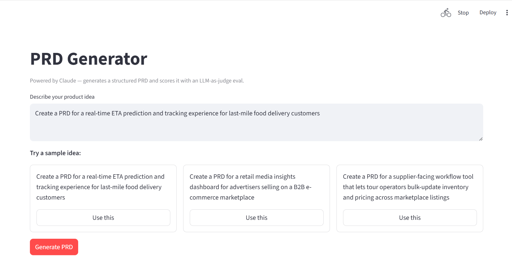
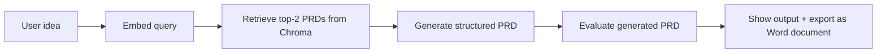
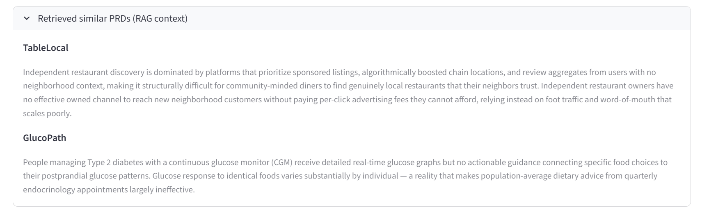

# PRD Generator with Eval Harness

A small Product Requirements Document (PRD) generator with a built-in evaluation flow.

The app takes a rough product idea, turns it into a structured PRD, and then scores the output against a rubric. I built this project to explore a question I have been thinking about for a while: once a GenAI demo works, how do you know if the output is good enough for someone to actually trust and use?

## About this work

This project was built across three weekends in late 2026 as part of my exploration of GenAI Product Manager roles in Germany and the Netherlands. The code and write-up are mine — the README, calibration notes, and corpus design reflect my own thinking and iteration process. If you're a recruiter or PM interested in this work, please reach out via [LinkedIn](https://www.linkedin.com/in/sumit5suman/).

**Live demo:** To be added after deployment



---

## What it does

You enter a product idea in plain English.

The app then does four things:

1. Finds the two closest reference PRDs from a curated 15-PRD corpus.
2. Uses those examples as context to generate a structured PRD.
3. Scores the generated PRD across five quality dimensions.
4. Lets the user download the final PRD as a Word document.

The five scoring dimensions are:

- Specificity
- Measurability
- Testability
- User-centricity
- Completeness

The generation part is useful, but the evaluation part is the real focus of the project. In my view, most GenAI product demos stop too early. They show that an output can be generated, but they do not clearly show whether that output is consistent, useful, or reliable.

This project is my attempt to look at that second part more seriously.

---

## Why I built it

In my previous work, I worked on a LangChain/OpenAI-based assistant for Unilever’s Customer Strategy & Planning (CSP) workflows. That project made me think a lot about grounded responses, response quality, and hallucination reduction. It also made one thing clear to me: fluent output is not the same as trustworthy output.

With this project, I wanted to test a specific question: can a Large Language Model (LLM) evaluate structured product output against a clear rubric, and how much calibration is needed before those scores become useful?

 I wanted this project to show how I think about LLM products beyond the prompt layer: retrieval quality, evaluation design, failure analysis, iteration, and the trade-offs that come up when turning a demo into something more dependable.

---

## Architecture



The app uses a small curated PRD corpus and a local Chroma vector index. The embedding model is `sentence-transformers/all-MiniLM-L6-v2`, which is lightweight enough to run locally on CPU.

For generation, the app uses Claude Sonnet 4.6. For evaluation, it uses Claude Haiku 4.5 so that the scoring step stays faster and cheaper than the main generation step.

---

## How the evaluation works

Most of the effort in this project went into the evaluation flow.

I created a 20-PRD calibration set:

- 10 intentionally strong PRDs
- 10 intentionally weak PRDs
- Domains included consumer health, B2B SaaS, fintech, enterprise platforms, and marketplaces

The first version of the rubric gave reasonable-looking scores, but it was too generous. It did not separate strong PRDs from weak PRDs clearly enough. I then tightened the rubric and fixed one issue in the generator prompt.

The separation between strong and weak PRDs improved across three versions:

| Version | Mean strong | Mean weak | Separation | Change |
|---|---:|---:|---:|---:|
| v1 baseline | 8.86 | 3.00 | 5.86 | — |
| v2 anchored rubric | 8.86 | 2.49 | 6.37 | +0.51 |
| v3 generator fix | 9.04 | 2.48 | 6.56 | +0.19 |

### v1 to v2: making the rubric stricter

The first rubric was too broad. It asked the judge to score things like completeness and user-centricity, but it did not define those terms sharply enough.

I added clearer scoring anchors for different score ranges. For example, instead of only saying “score completeness,” the rubric described what a 9-10, 4-6, and 1-3 answer should look like.

That made the judge more useful. Weak PRDs started getting lower scores for the right reasons, especially when they were vague or missing important product details.

### v2 to v3: fixing the generator, not just the judge

The most useful finding came from looking at why user-centricity was not improving as much as expected.

The generator was creating decent personas in the `target_users` section, but the user stories were still generic. Many of them started with:

> As a user, I want...

That looked fine at a glance, but it meant the PRD was not really connecting user stories back to the actual personas.

I updated the generator prompt so that user stories had to refer to the specific personas already defined in the PRD. After regenerating the strong PRDs, the score separation improved and crossed 6.5 points.

Before/after example: [persona_threading_fix_diff.md](examples/persona_threading_fix_diff.md)

Full calibration notes: [CALIBRATION.md](CALIBRATION.md)

---

## RAG corpus quality

The reference corpus has 15 PRDs that I curated across different product areas.

I kept the corpus small on purpose. For this project, I cared more about being able to inspect and trust the reference material than having a large dataset that I could not properly review.

During the first pass, I found two issues that I did not want to ignore.

### Fabricated citations

Some reference PRDs had citations that looked credible, but the statistics attached to those citations did not trace back to the actual source material.

This is a common failure mode in LLM-generated content. The source names may look real, but the specific numbers can still be invented.

### Overconfident benchmarks

A few PRDs also included specific percentages, dollar values, or benchmark claims without a reliable source behind them.

I removed those claims and replaced them with more honest product language, such as:

- “Expected range: X-Y”
- “Baseline to be established from first launch cohort”
- “To be validated during beta”
- “Target subject to initial usage data”

That made the corpus less flashy, but more realistic. Real pre-launch PRDs often do not have perfect benchmarks. They make assumptions clear and define how those assumptions will be validated.



---

## Product decisions

A few product and technical decisions were made deliberately.

### Small curated corpus

I used 15 curated PRDs instead of a large scraped corpus. A smaller corpus made it easier to check quality, spot bad references, and understand why a certain PRD was retrieved.

### Top-2 retrieval

The app retrieves only the two closest PRDs. In early testing, adding more context made the output longer, but not always better. Two examples gave the generator enough structure without overloading the prompt.

### Separate generation and evaluation steps

Generation and evaluation are separate. This makes debugging easier. If the final output is weak, I can check whether the issue came from retrieval, generation, or scoring.

### Word export

I added Word export because PRDs live as documents in real PM workflows — shared in Slack, reviewed in Google Docs, pasted into Jira tickets. A generated PRD that can't leave the app is just a demo.

---

## Stack

- Claude Sonnet 4.6 for PRD generation
- Claude Haiku 4.5 for evaluation
- Anthropic Python SDK
- LangChain
- ChromaDB
- `sentence-transformers/all-MiniLM-L6-v2`
- Streamlit
- Python
- `python-docx`

---

## Run locally

Clone the repository:

```bash
git clone https://github.com/sumitsuman-droid/prd-generator-eval.git
cd prd-generator-eval
```

Create and activate a virtual environment.

On macOS/Linux:

```bash
python -m venv venv
source venv/bin/activate
```

On Windows PowerShell:

```powershell
python -m venv venv
.\venv\Scripts\Activate.ps1
```

Install dependencies:

```bash
pip install -r requirements.txt
```

Create a `.env` file:

```bash
ANTHROPIC_API_KEY=your_api_key_here
```

Build the vector index:

```bash
python build_index.py
```

Run the app:

```bash
streamlit run app.py
```

---

## Example workflow

1. Enter a rough product idea.
2. The app retrieves the two closest PRD examples from the corpus.
3. The generator creates a structured PRD.
4. The evaluation step scores the PRD across five dimensions.
5. The app shows the scores and feedback.
6. The user downloads the PRD as a Word document.

---

## What I would build next

### Multi-model evaluation

I would like to compare scores from more than one judge model. This would help reduce dependence on a single model’s scoring style.

### Human-rated calibration set

The current strong and weak PRDs are synthetic. A better version would use PRDs reviewed and scored by experienced Product Managers.

### Better examples inside the judge prompt

Some dimensions are harder to score from rubric language alone. User-centricity and testability would probably benefit from a few concrete examples inside the judge prompt.

### Targeted regeneration

Right now, the system can generate and evaluate a PRD. A useful next step would be to regenerate only the weak sections instead of rewriting the full PRD.

For example, if measurability is weak, the app should only rewrite success metrics and instrumentation.

### Retrieval diagnostics

I would also like to show why each reference PRD was retrieved and which parts of it influenced the generated output. That would make the retrieval step easier to trust.

---

## Known limitations

This is a portfolio project, not a production system.

Current limitations:

- The evaluation set is small.
- The strong and weak labels are synthetic.
- The judge can still be influenced by rubric wording.
- Retrieval is based on semantic similarity, not deep product-domain reasoning.
- The app does not yet support collaboration, comments, or version history.
- The Word export works, but the formatting can be improved.
- The judge model and the generator model are both Claude. A more rigorous evaluation would use a different model family as judge to reduce same-architecture bias.

More details: [KNOWN_ISSUES.md](KNOWN_ISSUES.md)

---

## What this project is not

This is not a claim of new AI research.

The system uses familiar building blocks: retrieval, structured generation, scoring rubrics, and document export.

What I wanted to demonstrate is the product thinking around those building blocks:

- defining what quality means
- testing whether quality can be measured
- finding failure modes before users do
- improving the system based on what the evaluation shows
- documenting trade-offs honestly

That is the part of GenAI product work I find most interesting.